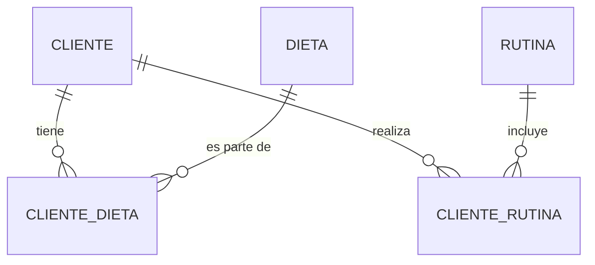

# Laboratorio N°11: Identificación de Atributos para el desarrollo de un Modelo Entidad-Relación

## INTRODUCCIÓN
Para crear un modelo Entidad-Relación correcto, debemos iniciar definiendo los atributos de cada entidad. Esta definición es importante para la construcción de un modelo robusto y confiable.

## PROCEDIMIENTO Y RESULTADOS
Dado el caso de una página dedicada al tema de “Vida Saludable”, la cual sugiere dieta y rutina de ejercicios a los clientes, sobre la base de su peso, estatura, medidas, sexo y edad, realizar lo siguiente:

### 1. Atributos de la entidad CLIENTE (mínimo 5 atributos y debe incluir la llave primaria):
| NOMBRE DEL ATRIBUTO | TIPO         |
| ------------------- | ------------ |
| cod_cliente (PK)    | CHAR(5)      |
| nombre              | VARCHAR2(50) |
| apellido            | VARCHAR2(50) |
| sexo                | CHAR(1)      |
| edad                | NUMBER(2)    |
| peso                | NUMBER(5,2)  |
| estatura            | NUMBER(5,2)  |

### 2. Atributos de la entidad RUTINA (mínimo 5 atributos y debe incluir la llave primaria):
| NOMBRE DEL ATRIBUTO | TIPO          |
| ------------------- | ------------- |
| cod_rutina (PK)     | CHAR(5)       |
| nombre_rutina       | VARCHAR2(50)  |
| tipo                | VARCHAR2(20)  |
| duracion_min        | NUMBER(3)     |
| nivel_dificultad    | VARCHAR2(20)  |
| equipo_necesario    | VARCHAR2(100) |

### 3. Atributos de la entidad DIETA (mínimo 5 atributos y debe incluir la llave primaria):
| NOMBRE DEL ATRIBUTO | TIPO         |
| ------------------- | ------------ |
| cod_dieta (PK)      | CHAR(5)      |
| nombre_dieta        | VARCHAR2(50) |
| calorias_totales    | NUMBER(4)    |
| tipo_dieta          | VARCHAR2(20) |
| duracion_dias       | NUMBER(3)    |

### 4. Atributos de la entidad relacional CLIENTE-DIETA (mínimo 3 atributos e incluyan la llave primaria y secundarias):
| NOMBRE DEL ATRIBUTO  | TIPO         |
| -------------------- | ------------ |
| cod_cliente (FK, PK) | CHAR(5)      |
| cod_dieta (FK, PK)   | CHAR(5)      |
| fecha_inicio         | DATE         |
| progreso             | VARCHAR2(20) |

### 5. Atributos de la entidad relacional CLIENTE-RUTINA (mínimo 3 atributos e incluyan la llave primaria y secundarias):
| NOMBRE DEL ATRIBUTO  | TIPO         |
| -------------------- | ------------ |
| cod_cliente (FK, PK) | CHAR(5)      |
| cod_rutina (FK, PK)  | CHAR(5)      |
| fecha_inicio         | DATE         |
| progreso             | VARCHAR2(20) |

### 6. Modelo de Entidad Relación (MER)


## Script
```sql
CREATE TABLE CLIENTE (
    cod_cliente CHAR(5) PRIMARY KEY,
    nombre VARCHAR2(50),
    apellido VARCHAR2(50),
    sexo CHAR(1),
    edad NUMBER(2),
    peso NUMBER(5,2),
    estatura NUMBER(5,2)
);

CREATE TABLE RUTINA (
    cod_rutina CHAR(5) PRIMARY KEY,
    nombre_rutina VARCHAR2(50),
    tipo VARCHAR2(20),
    duracion_min NUMBER(3),
    nivel_dificultad VARCHAR2(20),
    equipo_necesario VARCHAR2(100)
);

CREATE TABLE DIETA (
    cod_dieta CHAR(5) PRIMARY KEY,
    nombre_dieta VARCHAR2(50),
    calorias_totales NUMBER(4),
    tipo_dieta VARCHAR2(20),
    duracion_dias NUMBER(3)
);

CREATE TABLE CLIENTE_DIETA (
    cod_cliente CHAR(5),
    cod_dieta CHAR(5),
    fecha_inicio DATE,
    progreso VARCHAR2(20),
    PRIMARY KEY (cod_cliente, cod_dieta),
    FOREIGN KEY (cod_cliente) REFERENCES CLIENTE(cod_cliente),
    FOREIGN KEY (cod_dieta) REFERENCES DIETA(cod_dieta)
);

CREATE TABLE CLIENTE_RUTINA (
    cod_cliente CHAR(5),
    cod_rutina CHAR(5),
    fecha_inicio DATE,
    progreso VARCHAR2(20),
    PRIMARY KEY (cod_cliente, cod_rutina),
    FOREIGN KEY (cod_cliente) REFERENCES CLIENTE(cod_cliente),
    FOREIGN KEY (cod_rutina) REFERENCES RUTINA(cod_rutina)
);
```

## CONCLUSIONES
1. La identificación adecuada de los atributos permite definir con precisión la estructura de las entidades y sus relaciones.
2. La construcción del modelo Entidad-Relación es clave para garantizar la integridad y la organización de los datos.
3. La representación mediante scripts y diagramas facilita la implementación y documentación del diseño en sistemas de bases de datos.