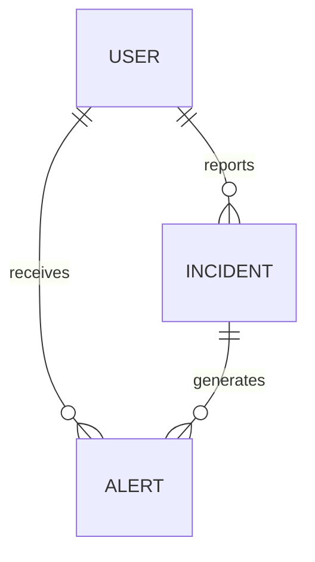

# Laboratorio N°13: Caso práctico sobre diseño de un modelo Entidad-Relación (MER) - Proyecto Final

## Introducción
En este laboratorio, se desarrollará el modelo Entidad-Relación (MER) para *Campana*, una aplicación de seguridad ciudadana que permite a los ciudadanos reportar y recibir alertas sobre incidentes en tiempo real en su ubicación actual. *Campana* se enfoca en la colaboración comunitaria para mejorar la seguridad en zonas urbanas mediante la geolocalización y la notificación instantánea.

## Procedimiento y resultados
Dado el objetivo de crear el modelo Entidad-Relación para *Campana*, se han definido las siguientes entidades y atributos clave, basados en el caso práctico descrito.

## Desarrollo

### 1. Entidades
#### User
| Attribute         | Type          |
| ----------------- | ------------- |
| user_code (PK)    | CHAR(5)       |
| name              | VARCHAR2(50)  |
| last_name         | VARCHAR2(50)  |
| phone             | VARCHAR2(15)  |
| email             | VARCHAR2(50)  |
| address           | VARCHAR2(100) |
| registration_date | DATE          |

#### Incident
| Attribute          | Type          |
| ------------------ | ------------- |
| incident_code (PK) | CHAR(5)       |
| user_code (FK)     | CHAR(5)       |
| incident_type      | VARCHAR2(30)  |
| description        | VARCHAR2(200) |
| incident_date      | DATE          |
| incident_time      | VARCHAR2(5)   |
| location           | VARCHAR2(100) |
| evidence           | BLOB          |

#### Alert
| Attribute          | Type        |
| ------------------ | ----------- |
| alert_code (PK)    | CHAR(5)     |
| incident_code (FK) | CHAR(5)     |
| user_code (FK)     | CHAR(5)     |
| alert_date         | DATE        |
| alert_time         | VARCHAR2(5) |
| impact_radius_km   | NUMBER(2)   |

### 2. Relación entre las entidades
- **User**: Puede reportar múltiples INCIDENTES y recibir múltiples ALERTAS.
- **INCIDENTE**: Es reportado por un USUARIO y puede generar una o más ALERTAS para otros usuarios en el área cercana.
- **ALERTA**: Está asociada a un INCIDENTE y es enviada a los USUARIOS en el radio de impacto definido.

### 3. Modelo de Entidad Relación (MER)


## Script
```sql
CREATE TABLE USER (
    user_code CHAR(5) PRIMARY KEY,
    name VARCHAR2(50),
    last_name VARCHAR2(50),
    phone VARCHAR2(15),
    email VARCHAR2(50),
    address VARCHAR2(100),
    registration_date DATE
);

CREATE TABLE INCIDENT (
    incident_code CHAR(5) PRIMARY KEY,
    user_code CHAR(5),
    incident_type VARCHAR2(30),
    description VARCHAR2(200),
    incident_date DATE,
    incident_time VARCHAR2(5),
    location VARCHAR2(100),
    evidence BLOB,
    FOREIGN KEY (user_code) REFERENCES USER(user_code)
);

CREATE TABLE ALERT (
    alert_code CHAR(5) PRIMARY KEY,
    incident_code CHAR(5),
    user_code CHAR(5),
    alert_date DATE,
    alert_time VARCHAR2(5),
    impact_radius_km NUMBER(2),
    FOREIGN KEY (incident_code) REFERENCES INCIDENT(incident_code),
    FOREIGN KEY (user_code) REFERENCES USER(user_code)
);
```

## CONCLUSIONES
1. El desarrollo de un modelo Entidad-Relación para Campana facilita la comprensión de las relaciones entre usuarios y eventos de seguridad, permitiendo una estructura de datos coherente.
2. La definición adecuada de atributos y entidades asegura que la aplicación pueda manejar y almacenar información detallada de incidentes y alertas en tiempo real.
3. La implementación de este diseño en una base de datos relacional es fundamental para mantener la integridad y el rendimiento del sistema de Campana.