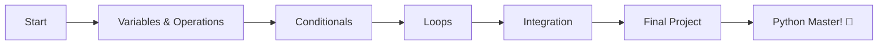

# 🐍 Python Fundamentals Guide

> A complete, beginner-friendly guide to learn Python programming from scratch with 20+ practical exercises.

[](https://www.python.org/)
[](LICENSE)
[](exercises.py)

---

## 📖 About

This repository contains a comprehensive Python learning guide designed for absolute beginners. Learn programming fundamentals through hands-on exercises with emojis, clear explanations, and real-world examples.

### ✨ What's Included

- **20 Progressive Exercises** covering all fundamentals
- **4 Core Topics** from basics to integration
- **1 Final Project** to test your skills
- **Interactive Menu** for easy navigation
- **Test Cases** for each exercise
- **Complete Documentation** in Spanish ([guide.md](./guide.md))

---

## 🎯 Topics Covered

| Topic                   | Exercises   | Focus                               |
| ----------------------- | ----------- | ----------------------------------- |
| **1️⃣ Algorithms & Code** | 5 exercises | Variables, operations, input/output |
| **2️⃣ Conditionals**      | 5 exercises | if/elif/else, decision making       |
| **3️⃣ Loops**             | 5 exercises | for/while, iteration, automation    |
| **4️⃣ Integration**       | 5 exercises | Combining all concepts              |
| **🏆 Final Project**     | 1 project   | Grade management system             |

---

## 🚀 Quick Start

### Prerequisites

```bash
Python 3.7 or higher
```

### Installation

```bash
# Clone the repository
git clone https://github.com/elliotgaramendi/tecsup.git

# Navigate to directory
cd ./o1/programming/projects/o1_introduction/

# Run the interactive menu
python main.py
```

### Usage

**Method 1: Interactive Menu** (Recommended)
```python
# In exercises.py, uncomment:
main_menu()
```

**Method 2: Run Specific Exercise**
```python
# In exercises.py, uncomment the exercise you want:
exercise_01()  # Simple Addition Calculator
exercise_15()  # Odd Sum Calculator
final_project()  # Grade Management System
```

---

## 📚 Exercise List

<details>
<summary><b>Topic 1: Algorithms & Code Representation</b></summary>

- 1.1 ➕ Simple Addition Calculator
- 1.2 📐 Rectangle Area Calculator
- 1.3 🌡️ Temperature Converter
- 1.4 📊 Average Calculator
- 1.5 📏 Rectangle Perimeter Calculator

</details>

<details>
<summary><b>Topic 2: Conditional Structures</b></summary>

- 2.1 🔢 Even/Odd Detector
- 2.2 ➕➖ Number Classifier (Positive/Negative/Zero)
- 2.3 ⚖️ Number Comparator
- 2.4 👥 Age Classifier
- 2.5 ➕➗ Simple Calculator (Addition/Subtraction/Multiplication/Division)

</details>

<details>
<summary><b>Topic 3: Loop Structures</b></summary>

- 3.1 🔢 Number Counter (1 to 10)
- 3.2 🧮 Sum Calculator (1 to 5)
- 3.3 ✖️ Multiplication Table of 2
- 3.4 🔢 Even Number Counter
- 3.5 🧮 Odd Sum Calculator

</details>

<details>
<summary><b>Topic 4: Knowledge Integration</b></summary>

- 4.1 📊 Grade Average Calculator
- 4.2 ➕➖ Positive/Negative Counter
- 4.3 ✖️ Custom Multiplication Table
- 4.4 🧮 Factorial Calculator
- 4.5 🎯 Number Guessing Game

</details>

<details>
<summary><b>Final Project</b></summary>

- 🏫 Student Grade Management System
  - Register students
  - Record grades
  - Calculate statistics
  - Generate reports

</details>

---

## 💡 Learning Path



**Recommended approach:**
1. ✅ Start with Topic 1 (Exercises 1.1 - 1.5)
2. ✅ Practice Topic 2 (Exercises 2.1 - 2.5)
3. ✅ Master Topic 3 (Exercises 3.1 - 3.5)
4. ✅ Integrate Topic 4 (Exercises 4.1 - 4.5)
5. ✅ Complete Final Project
6. 🚀 Build your own projects!

---

## 📂 Repository Structure

```
python-fundamentals-guide/
├── README.md           # This file
├── guide.md           # Complete guide (Spanish)
├── main.py       # All exercises and solutions
└── LICENSE            # MIT License
```

---

## 🎓 Learning Outcomes

After completing this guide, you will be able to:

- ✅ Understand Python syntax and basic operations
- ✅ Use variables and data types effectively
- ✅ Make decisions with conditional statements
- ✅ Automate tasks using loops
- ✅ Combine concepts to solve real problems
- ✅ Think algorithmically and debug code
- ✅ Build simple but functional programs

---

## 🤝 Contributing

Contributions are welcome! Feel free to:

- 🐛 Report bugs
- 💡 Suggest new exercises
- 📝 Improve documentation
- 🌍 Translate to other languages

---

## 📄 License

This project is licensed under the MIT License - see the [LICENSE](LICENSE) file for details.

---

## 🌟 Acknowledgments

- Inspired by real beginner programming challenges
- Designed with love for aspiring programmers
- Built with simplicity and effectiveness in mind

---

## 📬 Contact

Questions? Suggestions? Feel free to open an issue or reach out!

**Happy Coding! 🚀🐍**

---

<div align="center">

Made with ❤️ by [Elliot Garamendi](https://github.com/elliotgaramendi) for the programming community

⭐ Star this repo if you find it helpful!

</div>
