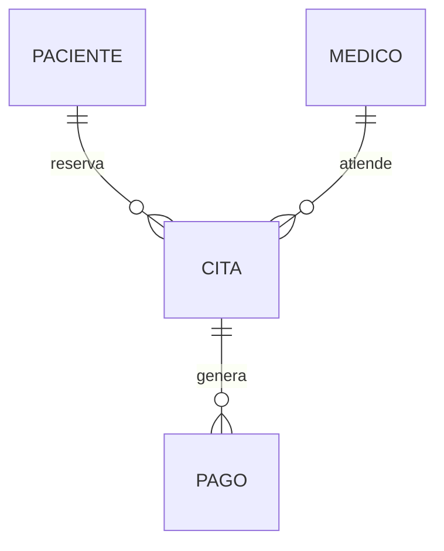

# Laboratorio N°12: Diseñan un modelo entidad relación con los atributos y relaciones correspondientes (MER)

## INTRODUCCIÓN
Para crear un modelo Entidad-Relación, debemos definir las relaciones entre las entidades. La cardinalidad puede ser: uno a uno, uno a muchos, muchos a uno y muchos a muchos.

## PROCEDIMIENTO Y RESULTADOS
Desarrolle un modelo MER para un sistema de *GESTIÓN DE CITAS MÉDICAS AMBULATORIAS DE UNA CLÍNICA*. Para ello, los pacientes deben llamar al Call Center de la clínica y reservar su cita. El personal debe poder visualizar la disponibilidad de citas para las diferentes especialidades médicas con las que dispone la clínica. La clínica ha dispuesto de un médico por especialidad que atenderá de lunes a viernes de 3pm a 9pm. Las reservas serán solo para la semana siguiente al día de la llamada. El pago de la atención médica será de dos tipos: por seguro médico con un costo de S/.50.00 y de forma particular con un costo de S/.80.00.

### 1. PACIENTE
| NOMBRE DEL ATRIBUTO | TIPO          |
| ------------------- | ------------- |
| cod_paciente (PK)   | CHAR(5)       |
| nombre              | VARCHAR2(50)  |
| apellido            | VARCHAR2(50)  |
| telefono            | VARCHAR2(15)  |
| direccion           | VARCHAR2(100) |
| fecha_nacimiento    | DATE          |

### 2. MÉDICO
| NOMBRE DEL ATRIBUTO | TIPO         |
| ------------------- | ------------ |
| cod_medico (PK)     | CHAR(5)      |
| nombre              | VARCHAR2(50) |
| apellido            | VARCHAR2(50) |
| especialidad        | VARCHAR2(50) |
| telefono            | VARCHAR2(15) |

### 3. CITA
| NOMBRE DEL ATRIBUTO | TIPO         |
| ------------------- | ------------ |
| cod_cita (PK)       | CHAR(5)      |
| cod_paciente (FK)   | CHAR(5)      |
| cod_medico (FK)     | CHAR(5)      |
| fecha_cita          | DATE         |
| hora_cita           | VARCHAR2(5)  |
| tipo_pago           | VARCHAR2(20) |

### 4. PAGO
| NOMBRE DEL ATRIBUTO | TIPO        |
| ------------------- | ----------- |
| cod_pago (PK)       | CHAR(5)     |
| cod_cita (FK)       | CHAR(5)     |
| monto               | NUMBER(6,2) |
| fecha_pago          | DATE        |

### 5. Relación entre las entidades
- Un PACIENTE puede reservar una o más CITAS.
- Un MÉDICO puede atender múltiples CITAS, pero una CITA es atendida por un solo MÉDICO.
- Una CITA puede tener un registro de PAGO asociado.

### 6. Modelo de Entidad Relación (MER)


## Script
```sql
CREATE TABLE PACIENTE (
    cod_paciente CHAR(5) PRIMARY KEY,
    nombre VARCHAR2(50),
    apellido VARCHAR2(50),
    telefono VARCHAR2(15),
    direccion VARCHAR2(100),
    fecha_nacimiento DATE
);

CREATE TABLE MEDICO (
    cod_medico CHAR(5) PRIMARY KEY,
    nombre VARCHAR2(50),
    apellido VARCHAR2(50),
    especialidad VARCHAR2(50),
    telefono VARCHAR2(15)
);

CREATE TABLE CITA (
    cod_cita CHAR(5) PRIMARY KEY,
    cod_paciente CHAR(5),
    cod_medico CHAR(5),
    fecha_cita DATE,
    hora_cita VARCHAR2(5),
    tipo_pago VARCHAR2(20),
    FOREIGN KEY (cod_paciente) REFERENCES PACIENTE(cod_paciente),
    FOREIGN KEY (cod_medico) REFERENCES MEDICO(cod_medico)
);

CREATE TABLE PAGO (
    cod_pago CHAR(5) PRIMARY KEY,
    cod_cita CHAR(5),
    monto NUMBER(6,2),
    fecha_pago DATE,
    FOREIGN KEY (cod_cita) REFERENCES CITA(cod_cita)
);
```

## CONCLUSIONES
1. Identificar y definir correctamente las entidades y sus atributos garantiza la eficiencia y robustez del modelo de base de datos.
2. Diseñar un MER facilita la comprensión de las relaciones entre entidades y sus interacciones.
3. Implementar scripts SQL basados en un diseño adecuado optimiza la integridad y la operatividad de un sistema de base de datos.