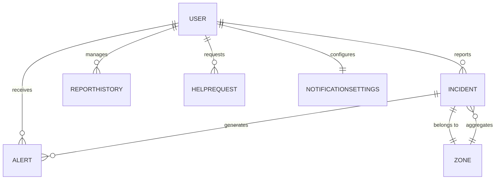

# Laboratorio N°14: Caso práctico sobre diseño de un modelo Entidad-Relación (MER) - Proyecto Final

## Introducción
En este laboratorio, se desarrollará un modelo Entidad-Relación (MER) avanzado para **Campana**, una aplicación de seguridad ciudadana. Este diseño integra las funcionalidades principales de la aplicación, incluyendo la gestión de usuarios, reportes, alertas, zonas peligrosas, configuraciones de notificaciones y soporte técnico.

## Procedimiento y resultados
Dado el alcance ampliado de **Campana**, se han definido las siguientes entidades y atributos clave, organizadas para soportar los módulos y pantallas requeridos.

## Desarrollo

### 1. Entidades principales
#### User
| Attribute         | Type          |
| ----------------- | ------------- |
| user_code (PK)    | CHAR(5)       |
| name              | VARCHAR2(50)  |
| last_name         | VARCHAR2(50)  |
| phone             | VARCHAR2(15)  |
| email             | VARCHAR2(50)  |
| password          | VARCHAR2(100) |
| address           | VARCHAR2(100) |
| registration_date | DATE          |
| is_admin          | BOOLEAN       |

#### Incident
| Attribute          | Type          |
| ------------------ | ------------- |
| incident_code (PK) | CHAR(5)       |
| user_code (FK)     | CHAR(5)       |
| incident_type      | VARCHAR2(30)  |
| description        | VARCHAR2(500) |
| incident_date      | DATE          |
| incident_time      | VARCHAR2(5)   |
| location           | VARCHAR2(100) |
| evidence           | BLOB          |
| status             | VARCHAR2(20)  | -- (Pending, Verified, Rejected) |

#### Alert
| Attribute          | Type        |
| ------------------ | ----------- |
| alert_code (PK)    | CHAR(5)     |
| incident_code (FK) | CHAR(5)     |
| user_code (FK)     | CHAR(5)     |
| alert_date         | DATE        |
| alert_time         | VARCHAR2(5) |
| impact_radius_km   | NUMBER(2)   |

#### Zone
| Attribute          | Type         |
| ------------------ | ------------ |
| zone_code (PK)     | CHAR(5)      |
| name               | VARCHAR2(50) |
| risk_level         | VARCHAR2(20) | -- (Low, Medium, High) |
| incident_count     | NUMBER(5)    |
| last_incident_date | DATE         |

#### NotificationSettings
| Attribute             | Type      |
| --------------------- | --------- |
| settings_code (PK)    | CHAR(5)   |
| user_code (FK)        | CHAR(5)   |
| receive_all_incidents | BOOLEAN   |
| receive_emergencies   | BOOLEAN   |
| radius_preference_km  | NUMBER(2) |

### 2. Entidades secundarias
#### ReportHistory
| Attribute          | Type         |
| ------------------ | ------------ |
| report_code (PK)   | CHAR(5)      |
| user_code (FK)     | CHAR(5)      |
| incident_code (FK) | CHAR(5)      |
| action_date        | DATE         |
| action_type        | VARCHAR2(20) | -- (Created, Edited, Deleted) |

**Propósito:** La entidad **ReportHistory** permite registrar un historial de acciones realizadas sobre los reportes por un usuario. Esto incluye la creación inicial del reporte, modificaciones posteriores (como actualizar una descripción), o eliminaciones. Esto asegura trazabilidad y responsabilidad en los reportes realizados.

#### HelpRequest
| Attribute           | Type          |
| ------------------- | ------------- |
| help_code (PK)      | CHAR(5)       |
| user_code (FK)      | CHAR(5)       |
| request_date        | DATE          |
| request_description | VARCHAR2(500) |
| response_status     | VARCHAR2(20)  | -- (Open, Resolved) |

**Propósito:** **HelpRequest** conecta a los usuarios con el centro de soporte técnico para resolver problemas o dudas relacionadas con la aplicación. Permite registrar y monitorear solicitudes, además de ofrecer retroalimentación a los usuarios.

### 3. Relación entre las entidades
- **User**: Puede reportar múltiples INCIDENTES, recibir ALERTAS, gestionar ZONAS y personalizar configuraciones de notificaciones.
- **Incident**: Genera ALERTAS, se vincula a una ZONA y puede ser gestionado a través de un HISTORIAL de reportes.
- **Zone**: Es un área geográfica que agrupa múltiples INCIDENTES y muestra estadísticas de riesgo.
- **NotificationSettings**: Permite a los usuarios personalizar los tipos y el alcance de las notificaciones que desean recibir.
- **HelpRequest**: Vincula a los usuarios con el centro de soporte para la resolución de problemas.
- **ReportHistory**: Garantiza la trazabilidad y responsabilidad en las acciones relacionadas con los reportes.

### 4. Modelo de Entidad Relación (MER)


## Script
```sql
CREATE TABLE USER (
    user_code CHAR(5) PRIMARY KEY,
    name VARCHAR2(50),
    last_name VARCHAR2(50),
    phone VARCHAR2(15),
    email VARCHAR2(50),
    password VARCHAR2(100),
    address VARCHAR2(100),
    registration_date DATE,
    is_admin BOOLEAN
);

CREATE TABLE INCIDENT (
    incident_code CHAR(5) PRIMARY KEY,
    user_code CHAR(5),
    incident_type VARCHAR2(30),
    description VARCHAR2(500),
    incident_date DATE,
    incident_time VARCHAR2(5),
    location VARCHAR2(100),
    evidence BLOB,
    status VARCHAR2(20),
    FOREIGN KEY (user_code) REFERENCES USER(user_code)
);

CREATE TABLE ALERT (
    alert_code CHAR(5) PRIMARY KEY,
    incident_code CHAR(5),
    user_code CHAR(5),
    alert_date DATE,
    alert_time VARCHAR2(5),
    impact_radius_km NUMBER(2),
    FOREIGN KEY (incident_code) REFERENCES INCIDENT(incident_code),
    FOREIGN KEY (user_code) REFERENCES USER(user_code)
);

CREATE TABLE ZONE (
    zone_code CHAR(5) PRIMARY KEY,
    name VARCHAR2(50),
    risk_level VARCHAR2(20),
    incident_count NUMBER(5),
    last_incident_date DATE
);

CREATE TABLE NOTIFICATIONSETTINGS (
    settings_code CHAR(5) PRIMARY KEY,
    user_code CHAR(5),
    receive_all_incidents BOOLEAN,
    receive_emergencies BOOLEAN,
    radius_preference_km NUMBER(2),
    FOREIGN KEY (user_code) REFERENCES USER(user_code)
);

CREATE TABLE REPORTHISTORY (
    report_code CHAR(5) PRIMARY KEY,
    user_code CHAR(5),
    incident_code CHAR(5),
    action_date DATE,
    action_type VARCHAR2(20),
    FOREIGN KEY (user_code) REFERENCES USER(user_code),
    FOREIGN KEY (incident_code) REFERENCES INCIDENT(incident_code)
);

CREATE TABLE HELPREQUEST (
    help_code CHAR(5) PRIMARY KEY,
    user_code CHAR(5),
    request_date DATE,
    request_description VARCHAR2(500),
    response_status VARCHAR2(20),
    FOREIGN KEY (user_code) REFERENCES USER(user_code)
);
```

## CONCLUSIONES
1. La estructuración de un modelo Entidad-Relación avanzado para Campana asegura la gestión eficiente de usuarios, reportes, alertas y configuraciones.
2. La inclusión de módulos como zonas peligrosas y soporte técnico mejora significativamente la funcionalidad de la aplicación.
3. Este diseño modularizado proporciona una base sólida para futuras ampliaciones y garantiza la integridad de los datos en un entorno complejo.