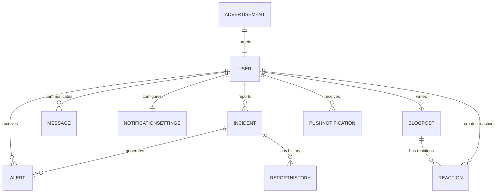

# Laboratorio N°15: Caso práctico sobre diseño de un modelo Entidad-Relación (MER) - Proyecto Final Avanzado

## Introducción
En este laboratorio, se desarrollará un modelo Entidad-Relación (MER) avanzado para **Campana**, una aplicación de seguridad ciudadana que combina funcionalidades de reportes de incidentes, alertas, mensajería directa, publicaciones de blog oficiales y configuración de notificaciones personalizadas. Este diseño está optimizado para bases de datos Oracle, utilizando tipos de datos específicos.

## Procedimiento y resultados
El diseño de **Campana** se enfoca en lograr una estructura modular que soporte roles, trazabilidad de acciones y funcionalidades avanzadas, todo implementado en Oracle.

## Desarrollo

### 1. Entidades principales
#### User
| Attribute         | Type          |
| ----------------- | ------------- |
| user_code (PK)    | CHAR(5)       |
| name              | VARCHAR2(50)  |
| last_name         | VARCHAR2(50)  |
| phone             | VARCHAR2(15)  |
| email             | VARCHAR2(50)  |
| password          | VARCHAR2(100) |
| registration_date | DATE          |
| role              | VARCHAR2(20)  | -- (user, admin) |

#### Incident
| Attribute          | Type          |
| ------------------ | ------------- |
| incident_code (PK) | CHAR(5)       |
| user_code (FK)     | CHAR(5)       |
| incident_type      | VARCHAR2(30)  |
| description        | VARCHAR2(500) |
| incident_date      | DATE          |
| incident_time      | VARCHAR2(5)   |
| location           | VARCHAR2(100) |
| evidence           | BLOB          |
| status             | VARCHAR2(20)  | -- (Pending, Verified, Rejected) |

#### Alert
| Attribute          | Type        |
| ------------------ | ----------- |
| alert_code (PK)    | CHAR(5)     |
| incident_code (FK) | CHAR(5)     |
| user_code (FK)     | CHAR(5)     |
| alert_date         | DATE        |
| alert_time         | VARCHAR2(5) |
| impact_radius_km   | NUMBER(2)   |

#### BlogPost
| Attribute         | Type          |
| ----------------- | ------------- |
| post_code (PK)    | CHAR(5)       |
| user_code (FK)    | CHAR(5)       |
| title             | VARCHAR2(100) |
| content           | CLOB          |
| created_date      | DATE          |
| last_updated_date | DATE          |

#### Advertisement
| Attribute       | Type          |
| --------------- | ------------- |
| ad_code (PK)    | CHAR(5)       |
| title           | VARCHAR2(100) |
| content         | VARCHAR2(500) |
| display_date    | DATE          |
| expiration_date | DATE          |
| target_roles    | VARCHAR2(50)  | -- (user, admin, all) |

#### Message
| Attribute           | Type          |
| ------------------- | ------------- |
| message_code (PK)   | CHAR(5)       |
| sender_user_code    | CHAR(5)       |
| recipient_user_code | CHAR(5)       |
| message_body        | VARCHAR2(500) |
| sent_date           | DATE          |
| status              | VARCHAR2(20)  | -- (Sent, Delivered, Read) |

#### NotificationSettings
| Attribute             | Type      |
| --------------------- | --------- |
| settings_code (PK)    | CHAR(5)   |
| user_code (FK)        | CHAR(5)   |
| receive_all_incidents | NUMBER(1) | -- (1 for true, 0 for false) |
| receive_emergencies   | NUMBER(1) | -- (1 for true, 0 for false) |
| radius_preference_km  | NUMBER(2) |

#### ReportHistory
| Attribute          | Type         |
| ------------------ | ------------ |
| report_code (PK)   | CHAR(5)      |
| user_code (FK)     | CHAR(5)      |
| incident_code (FK) | CHAR(5)      |
| action_date        | DATE         |
| action_type        | VARCHAR2(20) | -- (Created, Edited, Deleted) |

#### PushNotification
| Attribute                | Type          |
| ------------------------ | ------------- |
| notification_code (PK)   | CHAR(5)       |
| title                    | VARCHAR2(100) |
| content                  | VARCHAR2(500) |
| sent_date                | DATE          |
| recipient_user_code (FK) | CHAR(5)       |

#### Reaction
| Attribute          | Type         |
| ------------------ | ------------ |
| reaction_code (PK) | CHAR(5)      |
| user_code (FK)     | CHAR(5)      |
| post_code (FK)     | CHAR(5)      |
| reaction_type      | VARCHAR2(20) | -- (Like, Dislike, Agree, Disagree) |
| reaction_date      | DATE         |

---

### 2. Modelo de Entidad Relación (MER)


## Script
```sql
CREATE TABLE USER (
    user_code CHAR(5) PRIMARY KEY,
    name VARCHAR2(50),
    last_name VARCHAR2(50),
    phone VARCHAR2(15),
    email VARCHAR2(50),
    password VARCHAR2(100),
    registration_date DATE,
    role VARCHAR2(20) -- (user, admin)
);

CREATE TABLE INCIDENT (
    incident_code CHAR(5) PRIMARY KEY,
    user_code CHAR(5),
    incident_type VARCHAR2(30),
    description VARCHAR2(500),
    incident_date DATE,
    incident_time VARCHAR2(5),
    location VARCHAR2(100),
    evidence BLOB,
    status VARCHAR2(20),
    FOREIGN KEY (user_code) REFERENCES USER(user_code)
);

CREATE TABLE ALERT (
    alert_code CHAR(5) PRIMARY KEY,
    incident_code CHAR(5),
    user_code CHAR(5),
    alert_date DATE,
    alert_time VARCHAR2(5),
    impact_radius_km NUMBER(2),
    FOREIGN KEY (incident_code) REFERENCES INCIDENT(incident_code),
    FOREIGN KEY (user_code) REFERENCES USER(user_code)
);

CREATE TABLE BLOGPOST (
    post_code CHAR(5) PRIMARY KEY,
    user_code CHAR(5),
    title VARCHAR2(100),
    content CLOB,
    created_date DATE,
    last_updated_date DATE,
    FOREIGN KEY (user_code) REFERENCES USER(user_code)
);

CREATE TABLE ADVERTISEMENT (
    ad_code CHAR(5) PRIMARY KEY,
    title VARCHAR2(100),
    content VARCHAR2(500),
    display_date DATE,
    expiration_date DATE,
    target_roles VARCHAR2(50) -- (user, admin, all)
);

CREATE TABLE MESSAGE (
    message_code CHAR(5) PRIMARY KEY,
    sender_user_code CHAR(5),
    recipient_user_code CHAR(5),
    message_body VARCHAR2(500),
    sent_date DATE,
    status VARCHAR2(20),
    FOREIGN KEY (sender_user_code) REFERENCES USER(user_code),
    FOREIGN KEY (recipient_user_code) REFERENCES USER(user_code)
);

CREATE TABLE NOTIFICATIONSETTINGS (
    settings_code CHAR(5) PRIMARY KEY,
    user_code CHAR(5),
    receive_all_incidents NUMBER(1),
    receive_emergencies NUMBER(1),
    radius_preference_km NUMBER(2),
    FOREIGN KEY (user_code) REFERENCES USER(user_code)
);

CREATE TABLE REPORTHISTORY (
    report_code CHAR(5) PRIMARY KEY,
    user_code CHAR(5),
    incident_code CHAR(5),
    action_date DATE,
    action_type VARCHAR2(20),
    FOREIGN KEY (user_code) REFERENCES USER(user_code),
    FOREIGN KEY (incident_code) REFERENCES INCIDENT(incident_code)
);

CREATE TABLE PUSHNOTIFICATION (
    notification_code CHAR(5) PRIMARY KEY,
    title VARCHAR2(100),
    content VARCHAR2(500),
    sent_date DATE,
    recipient_user_code CHAR(5),
    FOREIGN KEY (recipient_user_code) REFERENCES USER(user_code)
);

CREATE TABLE REACTION (
    reaction_code CHAR(5) PRIMARY KEY,
    user_code CHAR(5),
    post_code CHAR(5),
    reaction_type VARCHAR2(20),
    reaction_date DATE,
    FOREIGN KEY (user_code) REFERENCES USER(user_code),
    FOREIGN KEY (post_code) REFERENCES BLOGPOST(post_code)
);
```

## Conclusiones
1. La inclusión de una tabla de reacciones amplía la interactividad en publicaciones de blog.
2. Este diseño modularizado asegura escalabilidad y una gestión eficiente de datos en Oracle.
3. La aplicación ahora soporta funcionalidades completas para reportes, alertas y publicaciones, mejorando la experiencia del usuario y la administración de contenidos.